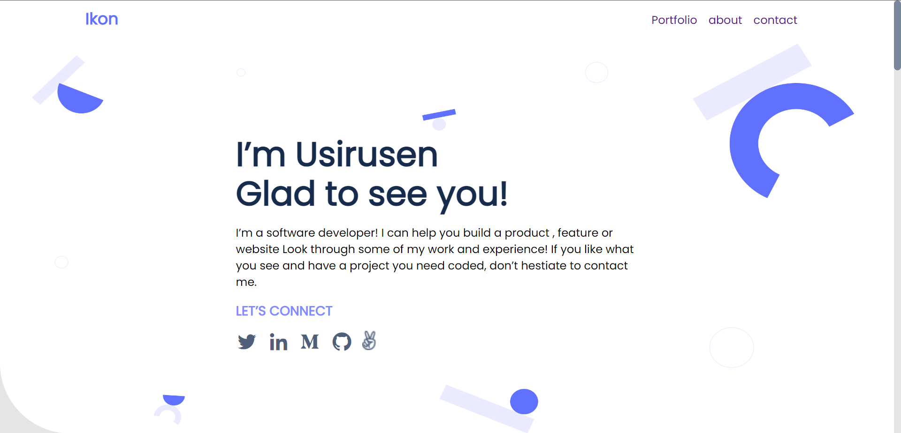

## Portfolio   
   For the fourth project in your portfolio website, you will:

   -Use media queries to make sure that your website displays correctly on desktop screens.

    

   
     
    The objectives of this project is to:
    
   -Understand how to create UIs adaptable to different screen sizes using media queries.
   -Understand how to parse a Figma design to create a UI.

## Built With
   - HTML & CSS (CSS Flex Box & Grid)
   - VS code
   
## Getting Started
   - To get a local copy up and running follow these simple example steps.
   
## Prerequisites
   - please install git in your computer.
   - Also install a code editor.
   - A web browser to view the output.
   - You need to make sure that your dekstop version looks like the one in the Figma design template that you chose. 
   
## Setup
   - To clone my repository run this command `git clone https://github.com/UsirusenIkon/Portfolio.git`  

## Author
    👤 **Usirusen Ikon**
   - GitHub: [@UsirusenIkon](https://github.com/UsirusenIkon)
   - Twitter: [@Usirusen_Ikon](https://twitter.com/Usirusen_Ikon)
   - LinkedIn: [Usirusen Ikon](https://www.linkedin.com/in/usirusen-ikon-775855174/)

## 🤝 Contributing
   - Contributions, issues, and feature requests are welcome!
   - Feel free to check the [issues](https://github.com/issues) page.

## Show your support
   - Give a ⭐️ if you like this project!

## Acknowledgments
   - Hat tip to anyone whose code was used
   - Inspiration
   - etc

## 📝 License
    - This project is [MIT](https://github.com/UsirusenIkon/Portfolio/blob/feature/LICENSE) licensed.
